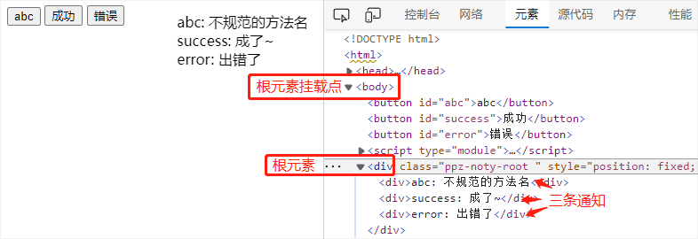

# noty.js API
@ppzp/noty 的核心代码只有 40 行左右，了解它最直接的方式就是看一眼[这 40 行代码](https://github.com/ppz-pro/noty.js/blob/main/noty.js)。当然，也可以看下文的介绍。

结构：
<p align="center"></p>

## Noty
Noty 是一个构造函数  
例子：
``` js
import Noty from '@ppzp/noty/noty.js'

const noty = Noty({
  rootClass: '',
  mount: document.querySelector('body'),
  customPosition: false,
  duration: 3000,
  // Animation: XXXAnimation,
  // Content: XXXContent,
})

// noty.info('...')
// noty.success('...')
```

参数如下：
#### rootClass
所有通知，都被添加到同一个根元素里  
通过 rootClass，可以设置根元素的 class，进而通过 css 控制根元素的样式  
默认值：```''```

#### mount
mount 用于指定根元素的挂载点  
noty.js 会以 ```mount.append(root)``` 的方式，把根元素添加到 html 文档流  
默认值：```document.querySelector('body')```

#### customPosition
默认情况下，根元素位于屏幕的右上角  
如果想放在其他位置，可以通过 ```customPosition: true```，并结合 ```rootClass``` 来设置  
默认值：false

#### duration
一次通知持续的时间  
默认值：3000（单位：毫秒）

#### Animation 和 Content
Animation 和 Content 是两个接口，用于定制通知的：
+ 出场、入场动画
+ 内容和行为

默认值：
``` js
import Animation from '@ppzp/noty/animation/index.js'
import Content from '@ppzp/noty/content/index.js'
```

> javascript 里没有“接口”的概念，但由于 Animation 和 Content 的行为、用法比较接近“接口”的概念，故称之

## Animation
最简实践：
``` js
const Animation = {
  show(content, root) {
    root.append(content)
  },
  close(content, root) {
    content.remove()
  }
}
```

```Animation``` 接口只有俩方法：
+ show 定义入场行为
+ close 定义出场行为

它们都只有两个参数，都是 ```HTMLElement``` 类型：
+ ```content``` 通知的内容元素（将在 Content 接口介绍）  
+ ```root``` 根元素

可以像上面的最简实践那样：  
通过 ```HTMLElement.prototype.append``` 将通知元素直接插入根元素  
后面的通知，出现在前面通知的下面（文档流中）  
通过 ```HTMLElement.prototype.remove``` 将通知元素从根元素移除

也可以像 noty.js 提供的[默认 Animation](https://github.com/ppz-pro/noty.js/blob/main/animation/index.js)，利用 flip 模式，让出入场较为丝滑

## Content
最简实践：
``` js
const Content = {
  success(text) {
    const div = document.createElement('div')
    div.append('success: ' + text)
    return div
  },
  error(text) {
    const div = document.createElement('div')
    div.append('error: ' + text)
    return div
  },
  abc(text) {
    // 通常情况下，不应该以 abc 作为函数的名字
    // 这里只是想提醒：方法的名字不是固定的，可以自定
    const div = document.createElement('div')
    div.append('abc: ' + text)
    return div
  }
}
```
准确地来说，Content 接口是**用户定义**的  
Content 的接口的每一个方法，将成为 Noty 实例的方法  
例如，对于上面的 Content 接口，将有：
``` js
const noty = Noty({
  Content
})

noty.success('...')
noty.error('...')
noty.abc('...')
```
其中 ```noty.success``` 可以接收任意参数，且将按**原顺序**，传递给 ```Content.success```  
即可以这样：
``` js
import Noty from '@ppzp/noty/noty.js'

const noty = Noty({
  Content: {
    success(title, subtitle) {
      const el = document.createElement('div')
      el.innerHTML = `
        <div class="title">${title}</div>
        <div class="subtitle">${subtitle}</div>
      `
      return el
    },
    // error(...) { ... }
  }
})

noty.success('操作成功', '数据已提交到主服务器')
```

另外，```success``` 方法里的 this上，有几个有用的属性和方法（在不使用箭头函数的情况下）：
#### this.root
根元素

#### this.duration
可以通过 ```this.duration = 5000``` 把通知的时间设置为 5 秒，例如：
``` js
const noty = Noty({
  Content: {
    success(title, subtitle, duration) {
      this.duration = duration
      // ...
    },
    // error(...) { ... }
  }
})

noty.success('操作成功', '数据已提交到主服务器', 5000)
```

#### this.closed()
可以通过 ```this.closed()``` 获知“通知是否已关闭”

#### this.close()
可以通过 ```this.close()``` 来关闭通知  
常用于“关闭按钮”，比如：
``` js
const noty = Noty({
  Content: {
    success(text) {
      const el = document.createElement('div')
      el.innerHTML = `
        <div>${text}</div>
        <div class="close-btn">x</div>
      `
      // 注意，下面是箭头函数，保留 this
      el.querySelector('.close-btn').onclick = () => {
        this.close()
      }
      return el
    },
    // error(...) { ... }
  }
})
```

#### this.onClose()
可以通过 ```this.onClose = function() { ... }``` 的方式，添加关闭时的回调函数  
> 注意：```onClose``` 将在 this.close 被调用时，立即执行。但此时可能由于动画效果还未结束，而导致 content 元素停留在文档流。

## NotyItem
```NotyItem``` 即上文 ```Content``` 部分提到的 ```this```  
它将被 ```noty.success(...)```, ```noty.error(...)``` 等函数返回  
例如：
``` js
const notyItem = noty.loading('数据加载中') // 加载数据前，显示通知
ajax.get('/xxx').then(function(res) {
  // 处理数据...
  notyItem.close() // 数据加载完成后，关闭通知
  noty.success('数据加载成功')
})
```

[最简实践](https://ppz-pro.github.io/noty.js/docs/custom/)